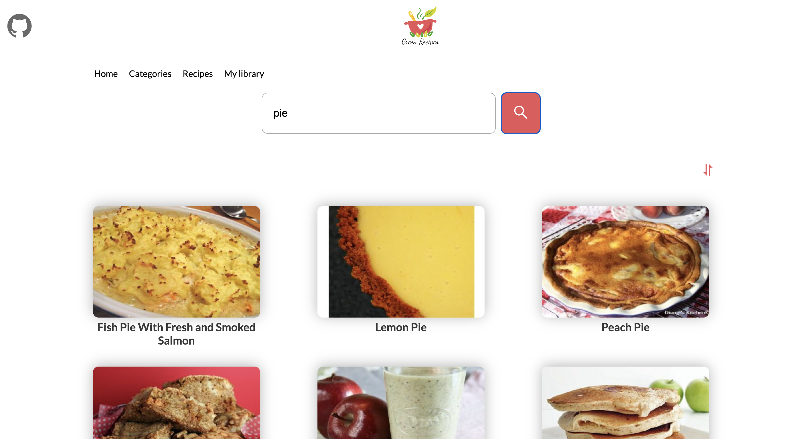

# Food Recipes🍕🧾

Food Recipes is the home of more than thousands of recipes that are listed on basis of various categories.Based on usual recipe website, where user can find out something to cook and after that add to library if he like it.


## Tech Stack

**Client:** React(Hooks), React-Router, RTK Query, Material UI


## Features

- Local Storage
- Search with filtering
- Pagination


## FAQ

#### How long has it been in development?

Development took about a week


## Screenshots





## Run Locally

Clone the project

```bash
  git clone https://github.com/thatsfov1/food-recipes.git
```

Go to the project directory

```bash
  cd food-recipes
```

Install dependencies

```bash
  npm install
```


